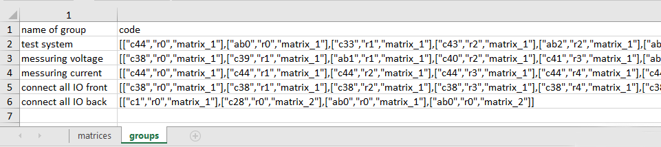
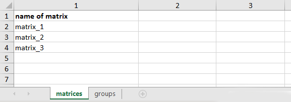
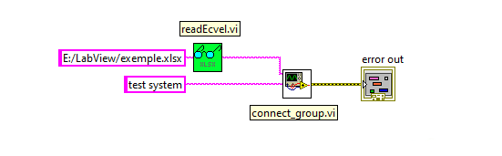

PXI matrix switcher control by input from Excel (Python, LabVIEW)

<details>
  <summary>Russian language</summary>
Управление матричным коммутатором PXI по входным данным из Excel (Python, LabVIEW).

Модуль основан на драйвере niswitch и предназначен для коммутаций реле на основе входных данных из Excel файла (xlsx). Использование модуля возможно непосредственно через Python модуль либо в составе LABview. Модуль совместим с виртуальным эмулятором матрицы.

Файл Excel должен содержать 2 вкладки с именами «matrices» и «groups». Первая вкладка содержит информацию о подключенных матрицах, вторая – о том какие реле необходимо замыкать. 
Коммутация реле происходит по заранее прописанными группами во вкладке «groups». Каждая группа представлена списком реле в формате JSON (столбец «code») и имеет свое имя (столбец «name»). В начале работы программы происходит парсинг Excel документа. В момент, когда требуется произвести коммутацию определенных реле – запускается модуль с заданным именем группы. 

Список реле вноситься в формате [["cX", "rY", "ZZZZ"], …]. Где каждый внутренний массив — это точка коммутации, а "X"- номер колонки, “Y” – номер строки, “ZZZZ” – имя матрицы. Для коммутации шины необходимо использовать формат [["abY", "card1rY", "ZZZZ"],…], где Y это номер строки, а “ZZZZ” – имя матрицы.
Например: [["c43", "r0", “matrix1”], ["c0", "r12", “matrix2”], ["ab2", "card1r2", "matrix2"]].
Указанные реле будут замкнуты, а все остальные будут разомкнуты.



Во вкладке «matrices» единственный столбец «name of matrix» — это содержит программные имена матриц.



Для использования Python модуля в отдельности от LABview:
```python
import matrix
#парсинг Excel
data = matrix.read_xlsx('E:/LabView/exemple.xlsx')
…
#крмутация реле группы “test system” из exemple.xlsx
# “3” – задержка после комутации все реле одной матрицы (ms)
connect_groups(data, “test system”, 3)
```

Использование в LABview:



 </details>
 
The module is based on the niswitch driver and is intended for switching relays based on input data from an Excel file (xlsx). Using the module is possible like Python module or as part of LABview. 

The module is compatible with the virtual matrix emulator.
The Excel file should contain 2 tabs named "matrices" and "groups". The first tab contains information about the connected matrices, the second - about which relays need to be closed.

Relay switching occurs according to pre-defined groups in the “groups” tab. Each group is represented by a list of relays in JSON format (column "code") and has its own name (column "name"). At the beginning of the program, the Excel document is parsed. At the moment when it is required to switch certain relays, the module with the specified group name is launched.

The list of relays must be entered in the format [["cX", "rY", "ZZZZ"], …]. Where each internal array is a crosspoint, and "X" is the column number, "Y" is the row number, "ZZZZ" is the matrix name. To switch the bus, use the format [["abY", "card1rY", "ZZZZ"],…], where Y is the line number and “ZZZZ” is the matrix name.
For example: [["c43", "r0", “matrix1”], ["c0", "r12", “matrix2”], ["ab2", "card1r2", "matrix2"]].
The specified relays will be closed and all others will be open.


In the "matrices" tab, the only column is "name of matrix" - this contains the programmatic names of the matrices.


To use the Python module separately from LABview:

```python
import matrix
#parsing Excel
data = matrix.read_xlsx('E:/LabView/exemple.xlsx')
…
#connect relay of group “test system” from exemple.xlsx
# “3” – time delay after all switching fo matrix (ms)
connect_groups(data, “test system”, 3)
```

For use in LABview:


